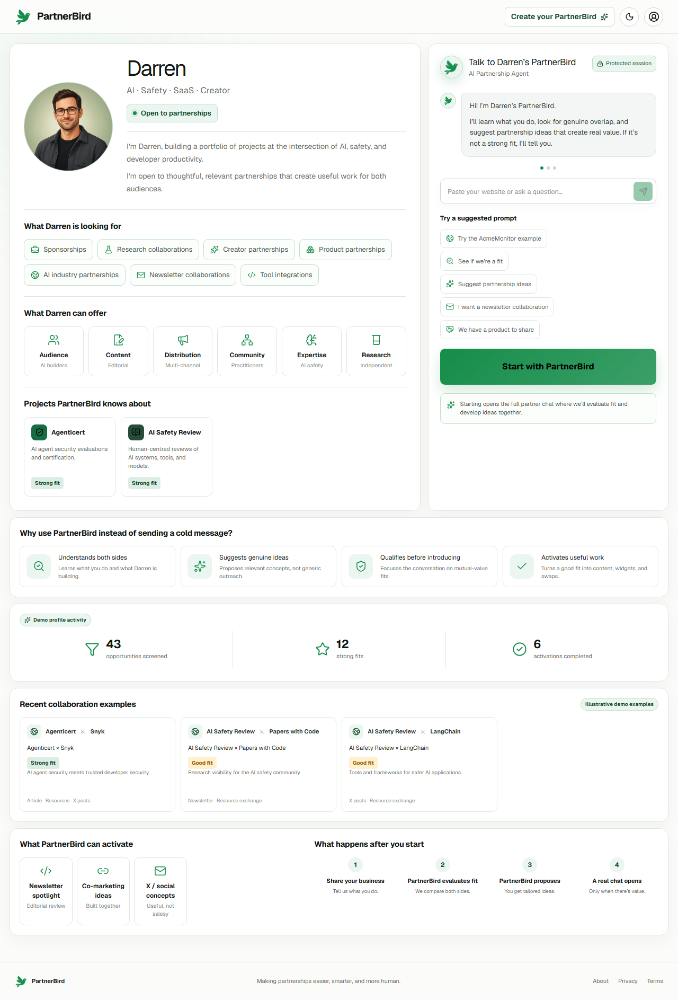
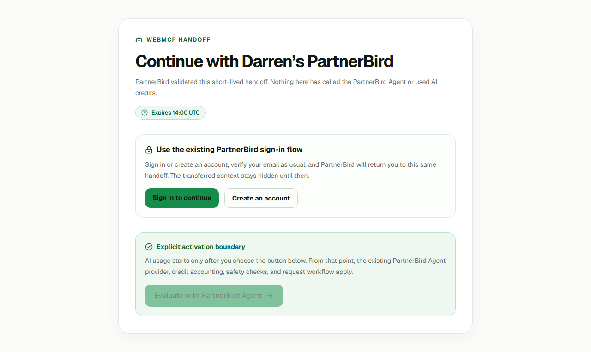

# PartnerBird WebMCP Demo

This is the public, sanitized PartnerBird WebMCP challenge edition. The primary
demo is **`/@darren`**.



## What is PartnerBird?

PartnerBird is an AI partnership agent that lives on a creator or company's
public profile. It helps both sides understand potential fit, develop useful
collaboration ideas, and move a promising opportunity toward a human-approved
partnership request.

## What this demo shows

```text
ChatGPT or Codex Browser
  → PartnerBird WebMCP
  → safe public partnership profile
  → potential fit and suggested context
  → private pending Agent handoff
  → authentication and email verification when required
  → explicit PartnerBird Agent evaluation
  → human-approved partnership request
```

The regular PartnerBird Agent Chat on `/@darren` is still available and still
uses its existing intake, authentication, verification, AI limits, provider,
spam, and request workflow. The WebMCP handoff is a second entry route; it does
not replace or silently alter normal Agent Chat.

## Why WebMCP?

WebMCP lets an external AI do the early discovery and reasoning using structured,
page-scoped tools. PartnerBird remains the trusted system for intentionally
public profile data, consent, identity checks, recipient protections, Agent
evaluation, and the final human decision. This separates inexpensive structured
discovery from PartnerBird's metered Agent work.

## WebMCP tools

On `/@darren`, anonymous visitors receive:

| Tool | Purpose |
| --- | --- |
| `get_profile` | Returns only the allowlisted public partnership profile. |
| `get_partnership_interests` | Returns public interests, capabilities, and activation options. |

Eligible authenticated users may also receive `save_partner`,
`create_request_draft`, and `prepare_agent_handoff` when both caller and
recipient permissions allow them.

The focused `/app/settings/webmcp` setup page exposes the authenticated,
permission-gated workflow tools: profile/preferences reads, capped search,
saved partners, request drafts, party-only request reads, and confirmed
submit/withdraw/respond actions. There are no bulk, admin, export, or mass
outreach tools.

## Agent handoff

`prepare_agent_handoff` stores a hashed, expiring, one-time handoff and returns
a same-origin preview URL. It does not send a request, contact Darren, call
OpenRouter, reserve usage, or start a conversation.

The preview survives sign-in, registration, and email verification by preserving
the exact internal return path. Only the user's explicit **Evaluate with
PartnerBird Agent** click creates the verified conversation. Agent usage starts
with the first Agent turn, and only this server-validated path may use
`WEBMCP_HANDOFF` mode to skip intake fields already supplied. Normal profile
visits always use `NORMAL` mode.



## Privacy and safety

- Public DTOs are constructed by explicit allowlist serializers; raw user or
  database objects are never returned.
- Authentication email, auth/database IDs, sessions, billing data, trust
  signals, private guidance, chat history, prompts, and provider details are
  excluded.
- User-authored content is marked as untrusted.
- WebMCP execution is same-origin and re-authorized on the server.
- Verified email and completed onboarding gate authenticated tools.
- Recipient consent, bilateral blocks, rate limits, cooldowns, duplicate
  prevention, eligibility checks, and stable idempotency keys remain enforced.
- High-risk request actions require a short-lived, payload-bound, single-use
  approval ticket created by visible PartnerBird UI.
- WebMCP profile reads, matching context, and handoff preparation consume zero
  PartnerBird AI credits and make zero OpenRouter calls.
- The final partnership request is never automatic; a human must approve it.

See [docs/WEBMCP.md](docs/WEBMCP.md) for the complete threat model and field
allowlist.

## Running locally

Prerequisites: Node.js 22+, a dedicated Neon Postgres branch, and a dedicated
Neon Auth configuration with email verification enabled.

1. Install dependencies.

   ```bash
   npm ci
   ```

2. Copy `.env.example` to `.env.local` and fill it with **demo-only**
   credentials. Keep `PARTNERBIRD_AGENT_MODE=mock` for deterministic review,
   or configure a server-side OpenRouter key to exercise live Agent evaluation.

3. Apply migrations and seed the fictional/demo Darren profile.

   ```bash
   npm run db:migrate
   npm run db:seed
   npm run db:check-webmcp-demo
   ```

4. Start the app and open the demo.

   ```bash
   npm run dev
   ```

   Visit [http://localhost:3000/@darren](http://localhost:3000/@darren).

5. Run the full deterministic verification.

   ```bash
   npm run check
   ```

## Testing WebMCP in Chrome

Use a Chrome build with WebMCP enabled (for compatible builds this is available
through `chrome://flags/#enable-webmcp-testing`), then open `/@darren` and
run:

```js
document.modelContext
```

```js
(await document.modelContext.getTools()).map((tool) => tool.name)
```

The anonymous result must include:

```js
["get_profile", "get_partnership_interests"]
```

Execute `get_profile` through Chrome's Model Context Tool Inspector or another
compatible WebMCP client using `{ "username": "darren" }`. Confirm that no
email, auth ID, private note, billing field, prompt, or OpenRouter data appears.

## Testing with ChatGPT or Codex Browser

1. Open the local or deployed `/@darren` page in a compatible built-in browser.
2. Ask the agent what Darren builds and what partnerships Darren is seeking.
3. Ask for a concrete partnership idea based on your business.
4. With an eligible verified demo account, ask it to prepare a PartnerBird Agent
   handoff.
5. Open the returned same-origin URL. If prompted, sign in or register and verify
   email; confirm you return to the same handoff.
6. Inspect the transferred context before activation. No Agent/OpenRouter usage
   has occurred yet.
7. Click **Evaluate with PartnerBird Agent**. The existing Agent flow now starts
   in `WEBMCP_HANDOFF` mode and normal usage rules begin.
8. Review and explicitly approve any eventual partnership request.

For a newly registered account, complete the focused onboarding and WebMCP
permission setup under `/app`. The general PartnerBird dashboard is
intentionally absent from this challenge edition.

## WebMCP source

Judges can review the implementation directly:

- [Tool catalog](src/lib/webmcp/tool-catalog.ts) and
  [schemas](src/lib/webmcp/schemas.ts)
- [Safe serializers](src/lib/webmcp/safe-serializers.ts)
- [Browser registry](src/components/webmcp/webmcp-registry.tsx)
- [Server service](src/server/webmcp/service.ts),
  [authorization](src/server/webmcp/auth.ts), and
  [policy](src/server/webmcp/policy.ts)
- [Handoff persistence](src/server/webmcp/agent-handoffs.ts) and
  [handoff page](src/app/agent/handoff/%5Btoken%5D/page.tsx)
- [Same-origin tool endpoint](src/app/api/webmcp/tools/%5Btool%5D/route.ts)
- [Human confirmation boundary](src/server/webmcp/confirmation.ts)
- [WebMCP tests](src/lib/webmcp) and [end-to-end spec](tests/e2e/webmcp.spec.ts)
- [AI cost boundary test](src/server/webmcp/ai-boundary.test.ts)

## Disclosure

This repository is a separate,
sanitized edition derived from the existing codebase and focused specifically
on the WebMCP implementation. It intentionally omits the production admin/CMS,
owner dashboard, billing/subscription UI, analytics, broad marketing site,
internal tools, private operational documentation, production data, local
environment files, and original Git history.

No production database, private PartnerBird repository, or production user
record is required or included. Use a dedicated demo environment.

## License

[MIT](LICENSE)
